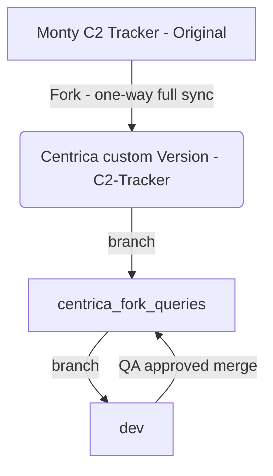

### Monty C2 Tracker IOAs

- Forked repo from https://github.com/montysecurity/C2-Tracker
- Many pre-built IOA signatures  included
- Some may be out of date
- Covers C2 frameworks, malware, tools, botnets
- Includes python script that contains queries
- We can select which queries we want and build them into the existing workflow
- Later we can branch and merge with their repo as we expand our own custom base
- For now we can limit which ones we select in our own dev branch
- Only need to sync the python script containing the queries for this

- From our fork we have the main branch called centrica_fork_queries
- From there 2 branches that we shall work from:
	- main (i.e centrica_fork_queries)
	- dev



- There will be a new queries directory containing subdirectories for each query platform e.g Shodan, Censys
- Queries will need to be reconstructed in the same format as the other IOA queries so there can be a separate directory for original and a subselection of newly formatted queries in each directory
- The queries will be run in parallel to the existing set and the output will available in the separate IOAs repo
- Therefore:
	- Query development in the sub branches of the Monty fork
	- CSV output in IOA repo


## Process

##### Sysadmin
- Ensure main repo is synced with Monty repo (can be scripted)
- Move to centrica_fork_queries branch
```
- git checkout centrica_fork_queries
```
- Pull updated file if there are changes
```
git checkout origin/main -- tracker.py
```
- Extract any new or modified queries and update queries in the relevent directories
- Add changes and commit
```
git add .
git commit -m "changes to xyz query"
```

##### Analyst
- Branch to centrica_fork_queries branch then to dev
- Add and commit chnages
- Push to branch
- Get QA done

##### Sysadmin
- Merge dev branch to centrica_fork_queries branch

## To do
- Set up sync of fork to Monty repo
- Configure the queries in correct format (build script to do programatically)
- Adjust (or duplicate) scripts to run against these queries
- Determine (with team) which to keep
- Operationalise the process
- More detailed guide for analyst on the relevent Git commands etc
